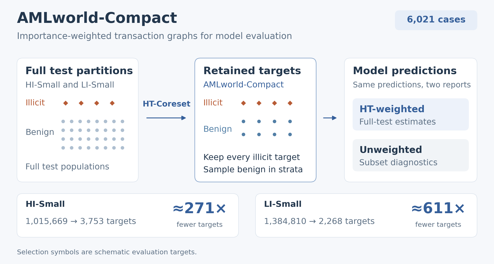

# AMLworld-Compact

<!-- dataset id: natnitaract/AMLworldCompactEval. If it ever changes, update it
     in: this badge and the Dataset section link,
     pyproject [project.urls] Dataset, and amlc/config.yaml sources.dataset_repo. -->

[](https://github.com/nat-nischw/AMLworld-Compact/actions/workflows/ci.yml)
[](https://huggingface.co/datasets/natnitaract/AMLworldCompactEval)
[](LICENSE)

[Install](#install) · [Evaluation](#evaluation) · [Baselines](#baselines) ·
[Dataset](#dataset) · [Citation](#citation)

The AMLworld-Compact evaluation set provides importance-weighted subsets of AMLworld for evaluating
transaction classification and laundering-typology prediction. HT-Coreset retains all
illicit test edges and samples benign edges, reducing evaluation-target counts
by 271× on HI-Small and 611× on LI-Small. Each retained edge has graph
features, a serialised local graph,
and an inverse-inclusion-probability weight.



## Install

Use Python 3.11 or later. Run commands from the code repository root:

```bash
git clone https://github.com/nat-nischw/AMLworld-Compact.git
cd AMLworld-Compact
python -m pip install -e ".[hub]"
```

This installs the dataset loaders and scoring dependencies. To generate predictions
through an existing vLLM endpoint, also install the LLM client dependencies:

```bash
python -m pip install -e ".[llm]"
```

## Evaluation

### Score the released supervised ensemble

The following example loads the evaluation arrays and scores the released ensemble
without training or generating new predictions. The first Hub load downloads the
arrays; subsequent loads use the cache.
While the dataset is private, Hub access requires authentication with an
account that has permission to read it.

<!--quick-start-begin-->
```python
import numpy as np
from amlc import hub
from amlc.triage.doubt_triage import ht_weighted_prf

d = hub.load_coreset("HI-Small")
predictions = (d["ensemble_probs"] >= d["ml_threshold"]).astype(int)

for name, weights in [
    ("HT-weighted (full test)", d["weights"]),
    ("Unweighted (subset)", np.ones(d["n"])),
]:
    precision, recall, f1 = ht_weighted_prf(predictions, d["labels"], weights)
    print(f"{name}: P={100 * precision:.4f}% R={100 * recall:.4f}% F1={100 * f1:.4f}%")
```
<!--quick-start-end-->

For your own detector, replace `predictions` with a one-dimensional binary array:
`1` means illicit and `0` means benign. It must contain exactly one prediction per
released row, in the same order as `d["labels"]`. Join unordered outputs to the
`case_id` column of `hub.load_table("HI-Small")` before scoring. If probabilities
cover the full file-order test partition, select `probabilities[d["subset_idx"]]` first,
then apply your chosen decision threshold.

To check both released ensembles and their weight sums:

```bash
python -m amlc.selftest
```

With a local copy of the dataset, the array loader can run offline. Point it at
`extras/`, which contains one directory per split:

```bash
AMLC_CORESET_DIR=/path/to/amlcompact-dataset/extras python -m amlc.selftest
```

`AMLC_CORESET_DIR` overrides array loading; `hub.load_table()` still reads the Hub
Parquet table. To load local prompts, use `pandas.read_parquet()` on
`data/HI-Small/test-00000-of-00001.parquet` in the dataset copy.

### Generate LLM predictions

Use an existing vLLM server with a served model name matching a runner ID in
[Baselines](#baselines). The hosting configurations used for the released runs are
in [`scripts/slurm/host_vllm/`](scripts/slurm/host_vllm/). Set `--model-id` if your
endpoint exposes a different served name. These commands use the graph inputs
described in [Evaluation limitations](#evaluation-limitations).

```bash
python scripts/13_run_llm_eval.py \
  --model GPT-OSS-20B \
  --vllm-url http://localhost:8000/v1 \
  --datasets HI-Small LI-Small \
  --promptings ICL-ZS ICL-FS \
  --seeds 42 123 456 789 1011 \
  --workers 16 \
  --out runs/gpt-oss-20b
```

`ICL-ZS` and `ICL-FS` share task instructions and typed graph inputs; `ICL-FS`
adds eight illicit and four benign training demonstrations. `ICL-V` is an
additional supported condition and is not included in the baseline table
below. The coreset stays fixed across seeds;
the current runner sends each requested sampling seed to vLLM. The archived
paper runs used these numbers only as run identifiers and did not send them
to the model API. Server versions and batching can still affect reproducibility.
Use fewer values in `--datasets`, `--promptings`, or `--seeds` to evaluate a smaller
configuration. Each selected combination evaluates every row in that split.

The runner saves per-case verdicts, typologies, responses, available reasoning,
and token counts in per-seed JSON files under `--out`. It also writes
`metrics.json` beside those files and `summary_all.csv` / `summary_all.json` at
the output root. The runner's detection metrics are unweighted compact-set
metrics. Run the next step to obtain HT-weighted metrics.

The supplementary [frontier-API probe](results/frontier_probe/) uses separate
prompts and condensed graph inputs; its `ZS-Graph` and `ZS-Base` variants both
have no demonstrations.

### Score saved LLM predictions

This step reads predictions already saved by the runner and the released coreset
arrays. It does not call an LLM:

```bash
python scripts/23_score_llm_ht.py \
  --runs-dir runs/gpt-oss-20b \
  --models GPT-OSS-20B \
  --promptings ICL-ZS ICL-FS \
  --seeds 42 123 456 789 1011 \
  --dataset HI-Small --dataset LI-Small \
  --out runs/gpt-oss-20b/evaluation
```

Set `AMLC_CORESET_DIR` as above to score with local arrays. Match the model,
prompting, dataset, and seed selections to the prediction files you generated.

| Output in the evaluation directory | Contents |
|---|---|
| `llm_ht_weighted.csv` | One row per dataset/model/prompting/seed with both `ht_*` and `subset_*` detection metrics; also includes predict-all-illicit reference rows. |
| `llm_ht_weighted_summary.csv` | Ranges over model/prompting means within each dataset and the predict-all-illicit reference. |

### Metrics and reporting

Both reports score the same targets selected by HT-Coreset and the same
predictions. HT-weighted scoring uses the released `ht_weight`; unweighted
scoring sets every weight to one.

For binary labels `y`, predictions `p`, and weights `w`, the scorer computes
`TP = sum(w * (y == 1) * (p == 1))`, with analogous weighted FP and FN counts.
Precision is `TP / (TP + FP)`, recall is `TP / (TP + FN)`, and F1 is
`2 * TP / (2 * TP + FP + FN)`. A zero denominator returns zero.

| Metric | Population / denominator | Where to find it |
|---|---|---|
| HT-weighted detection precision, recall, F1 | Released coreset with `ht_weight`; estimates the full file-order test partition. | `ht_p`, `ht_r`, `ht_f1` |
| Unweighted (subset) detection precision, recall, F1 | Every retained row has weight one; describes the 1:2 illicit-to-benign subset. | `subset_p`, `subset_r`, `subset_f1`; runner detection columns |
| Detection accuracy | Fraction of all compact-set rows classified correctly. | Runner `detection_accuracy` |
| Typology macro-F1 | Unweighted mean of class F1 values on illicit rows with a known ground-truth typology. Benign verdicts and missing typologies become `none`; the macro average includes every label present in the ground truth or predictions, including this sentinel. | Runner `typology_macro_f1` |
| Typology accuracy | Fraction of labelled illicit rows with both an illicit verdict and a matching predicted typology. | Runner `typology_accuracy` |
| Recorded-token ratio (V%) | Percentage of attempted cases with positive recorded token usage, including some without a final answer. | Runner `valid_ratio` |

`ht_weighted_prf()` returns fractions in `[0, 1]`. Detection and typology scores in
the stage-23 and runner summary CSV files are percentages in `[0, 100]`; their
values in per-seed metric JSON are fractions. Counts, token usage, and latency
retain their own units; `token_stats.valid_ratio` is already a percentage.
Runner seed summaries report mean and standard deviation (`ddof=0`),
with zero standard deviation for a single run. The stage-23 summary reports ranges
of seed means, not confidence intervals. Evidence/verifier fields are not computed
by the standard ICL evaluation.

Report HT-weighted detection metrics as the primary full-split estimates, and label
unweighted subset metrics separately. Predicting every edge illicit gives unweighted precision
33.333% and F1 50.000%; after weighting, its F1 is 0.246% on HI-Small and 0.109% on
LI-Small. The predictions are the same; the weighting changes the evaluation
distribution. Precision lift divides HT-weighted precision by the full-test
illicit prevalence: 1.0 equals the predict-all-illicit reference.

With fixed per-edge predictions and contexts, positive known inclusion
probabilities make HT confusion counts unbiased in expectation. Precision and F1
are ratios and need not be unbiased in finite samples. Recall is exact for the
fixed predictor because every illicit edge is retained with weight one. Variation
across stochastic inference runs does not measure variation across newly sampled coresets.

### Reproduce the sampling-uncertainty analysis

The portable prediction arrays needed for this analysis are included. This
command needs neither the original run archive nor new LLM calls:

```bash
python scripts/25_score_sampling_uncertainty.py \
  --inputs results/analysis/sampling_uncertainty/inputs \
  --out runs/sampling_uncertainty
```

The [analysis notes](results/analysis/sampling_uncertainty/README.md) describe
the inputs, units, and conditional confidence intervals. In the paper, the main
LLM table gives a HI-Small overview; the full-results appendix adds LI-Small,
precision, recorded-token ratio, and run variation. The uncertainty table separates
variation across inference runs from uncertainty due to sampling benign targets.

### Additional checks from cached predictions and traces

The held-out-family study builds sampling strata with LightGBM and evaluates
XGBoost, then reverses their roles. It uses saved validation thresholds and
500 draws at each fixed budget. Every comparator retains all illicit cases
and uses HT weights. At the released sizes, hard-negative sampling has F1 RMSE
0.00–2.58 percentage points, versus 4.44–7.41 for uniform benign sampling.
Conservative interval widths remain 27.3–55.0 points for the hard-negative
sampler. See the [protocol and full results](results/analysis/heldout_sampling/README.md).

```bash
python scripts/26_evaluate_heldout_sampling.py \
  --inputs /path/to/dataset/ml_baselines --out runs/heldout_sampling
python scripts/27_audit_scoring_sensitivity.py --out runs/audit_sensitivity
```

These commands make no model calls. The first reads the full-test probabilities
and validation-threshold metadata shipped with the dataset. The second uses
portable trace features shipped with the code. Its [scoring sensitivity report](results/analysis/audit_sensitivity/README.md)
separates binary correctness, available typology references, the original benign
Match bypass, and the judges' 8,000-character window. These checks describe
archived outputs; they do not establish semantic grounding or causal reasoning failures.

### Target-marked inputs for new evaluations

A separate `targeted_prompts_v1` resource supplies the same 6,021 targets with
an explicit target ID, the target transaction present exactly once, bank-qualified
endpoints, and start/end/elapsed-time summaries computed from the included edges.
Its complete `evaluation_prompt` contains no outcome labels. Load it from a local
dataset copy:

```python
import pandas as pd

prompts = pd.read_parquet(
    "/path/to/dataset/extras/targeted_prompts_v1/HI-Small/test-00000-of-00001.parquet"
)
text_to_send = prompts.iloc[0]["evaluation_prompt"]
```

Send `evaluation_prompt` directly to your inference client. Join its outputs to
the original scoring rows by dataset and `case_id`. The historical evaluation
runner still uses the archived format; the paper's LLM scores do not evaluate
this new version. The repair retains the edge-count budget by replacing one
non-target edge when necessary; text length changes and has not been token-budget
tested against the models. The source graph and data partitions are unchanged.

The [integrity report](results/analysis/target_integrity/validation_report.json) records
source checks and input hashes. To rebuild into new directories without inference:

```bash
python scripts/28_build_targeted_prompts.py \
  --source-data /path/to/AMLworld_CSVs \
  --archive-root /path/to/llm_datasets \
  --dataset-release /path/to/dataset \
  --out runs/targeted_prompts_v1 --analysis-out runs/target_integrity
```

The builder requires the archived JSON and paper-format graph companions and
refuses to overwrite existing outputs. The [presence-conditioned analysis](results/analysis/target_presence/README.md)
uses cached predictions to describe historical inputs whose target is present or
absent; it is not a test of repaired prompts.

## Evaluation limitations

The reported LLM results use the original graph strings. All 6,021 inputs
leave the target transaction unmarked and the task template retains `<ID>`.
In 324/3,753 HI-Small and 297/2,268 LI-Small cases, the target
transaction itself is absent from the graph after neighbor capping. These
include 128 HI and 181 LI illicit targets. The `Time span` field counts distinct
timestamps rather than elapsed time. These results describe the evaluated input
format and do not isolate input effects from model reasoning errors.

Use the original inputs to reproduce the reported experiment. Evaluating the
target-marked version requires new inference with its complete
`evaluation_prompt`; saved predictions apply to the original version.

Published typology scores use archived postprocessed labels. The live parser
does not reproduce every historical free-text fallback; use the archived labels
for exact table reproduction. Files and columns named `seed` retain historical
run identifiers; the original API requests did not set those seeds.

## Baselines

### Supervised models

The published 60/20/20 train/validation/test partition uses released CSV row
order. Transactions are broadly ordered in time, but timestamp ranges overlap
across partitions; this is not a strictly chronological evaluation. The
released coreset is reproduced with sampling seed 0.

GFP means Graph Feature Preprocessor. Each booster uses 73 GFP signals and
6 raw transaction attributes (79 inputs). The primary ensemble averages
LightGBM and XGBoost probabilities across five seeds. It retains thresholds
0.80 for HI-Small and 0.48 for LI-Small from the original construction study;
these operating points were selected on the full test split.
ML and DT task comparisons at these points are exploratory.

| Full baseline name | Loader ID |
|---|---|
| LightGBM + Graph Feature Preprocessor | `LightGBM+GFP` |
| XGBoost + Graph Feature Preprocessor | `XGBoost+GFP` |

The released ensemble's HT-weighted P / R / F1 (%) is
84.8449 / 56.8345 / 68.0708 on HI-Small and
60.1695 / 18.7831 / 28.6290 on LI-Small. Its full-split and coreset values
coincide because all edges contributing to its TP, FP, and FN counts are retained
with weight one. This exact equality does not extend to arbitrary predictors.

The frozen sampling design originally used a third scorer, Graph Contrastive
Pre-training for Anti-money Laundering + GFP (GCPAL+GFP). It adds five
line-graph-derived features, giving 84 inputs. Its random fine-tuning
split overlaps the test partition. We preserve that construction history and
its original inclusion weights, while the primary evaluation ensemble uses only
the two boosters trained on the file-order partition. GCPAL checkpoints remain available as
construction assets.

Checkpoints and full-test probabilities are available through `hub.load_ml_weights()`
and `hub.load_test_probs()`. Use `d["subset_idx"]` to align full-test predictions
with coreset rows.

### Language models

| Model | Runner ID (`--model`) | Checkpoint |
|---|---|---|
| OpenAI GPT-OSS-20B | `GPT-OSS-20B` | `openai/gpt-oss-20b` |
| Qwen3.5-27B | `Qwen3.5-27B` | `Qwen/Qwen3.5-27B-FP8` |
| NVIDIA Nemotron-3-Nano-30B-A3B | `Nemotron-3-Nano-30B` | `nvidia/NVIDIA-Nemotron-3-Nano-30B-A3B-FP8` |
| Qwen3.5-35B-A3B | `Qwen3.5-35B-A3B` | `Qwen/Qwen3.5-35B-A3B-FP8` |
| OpenAI GPT-OSS-120B | `GPT-OSS-120B` | `openai/gpt-oss-120b` |
| NVIDIA Nemotron-3-Super-120B-A12B | `Nemotron-3-Super-120B` | `nvidia/NVIDIA-Nemotron-3-Super-120B-A12B-FP8` |
| Qwen3.5-397B-A17B | `Qwen3.5-397B-A17B` | `Qwen/Qwen3.5-397B-A17B-FP8` |

The following values are HT-weighted detection F1 (%), averaged over five stochastic runs
for each model and prompting condition. ZS means `ICL-ZS`; FS means `ICL-FS`.

| Model | HI-Small ZS | HI-Small FS | LI-Small ZS | LI-Small FS |
|---|---:|---:|---:|---:|
| OpenAI GPT-OSS-20B | 0.246 | 0.236 | 0.109 | 0.098 |
| Qwen3.5-27B | 0.230 | 0.240 | 0.088 | 0.096 |
| NVIDIA Nemotron-3-Nano-30B-A3B | 0.246 | 0.245 | 0.109 | 0.108 |
| Qwen3.5-35B-A3B | 0.246 | 0.253 | 0.109 | 0.107 |
| OpenAI GPT-OSS-120B | 0.246 | 0.249 | 0.109 | 0.108 |
| NVIDIA Nemotron-3-Super-120B-A12B | 0.247 | 0.247 | 0.110 | 0.109 |
| Qwen3.5-397B-A17B | 0.248 | 0.251 | 0.110 | 0.110 |

Source: [`results/analysis/llm_ht_weighted.csv`](results/analysis/llm_ht_weighted.csv).
These values are estimates at full-test illicit prevalence. Unweighted subset metrics
are available as `subset_*` columns in the same file.

## Dataset

| | HI-Small | LI-Small |
|---|---:|---:|
| Full test edges | 1,015,669 | 1,384,810 |
| Illicit edges retained | 1,251 | 756 |
| Evaluation targets retained | 3,753 | 2,268 |
| Illicit rows with a known typology | 791 | 174 |

The [dataset card](https://huggingface.co/datasets/natnitaract/AMLworldCompactEval)
describes all columns, feature arrays, weights, and checkpoint files. The 1:2
illicit-to-benign ratio is the most aggressive downsampling setting tested in
the reported sweep. Graph texts
use two-hop neighbourhoods with a cap of 50 incoming/outgoing neighbours per account per hop. The released data
contains test rows; use separate data when training and tuning a new model.
The released graph texts contain 272.47 million characters on HI-Small and
167.68 million on LI-Small, or roughly 68.12 million and 41.92 million
graph-text tokens under a four-characters-per-token estimate. This excludes
instructions, demonstrations, and generated output. Archived
`est_tokens_total` fields in `results/coreset/` extrapolate one synthetic
example and are not measured prompt costs.

## Repository layout

| Path | Contents |
|---|---|
| `amlc/` | Data loaders, coreset construction, baseline models, evaluation, triage, and audit code |
| `scripts/` | Command-line entry points and optional cluster configurations |
| `prompts/` | Task, demonstration, verification, and audit templates |
| `data/` | Tuned hyperparameters and demonstration pools |
| `results/` | Released metrics and analysis outputs |

The [figure index](results/figures/README.md) identifies the current manuscript
figures and distinguishes them from retained historical plots.

Run `make help` to list the available commands. For local checks, run
`make install-dev`, then `make test` and `make lint`.
The released detailed reasoning audit uses the available run-42 traces; task
metrics use five stochastic inference runs.

## Uses

This synthetic benchmark supports research on transaction classification,
graph-to-text prompting, and error analysis. Use the released test split for
evaluation and separate data for training and tuning. Results describe the
released AMLworld splits and do not establish performance on real banking
transactions.

## Licences

Code is [MIT](LICENSE). AMLworld-derived evaluation data is CDLA-Sharing-1.0;
released supervised model parameters and outputs are labelled MIT in the dataset
release. The Elliptic pipeline is provided without derived Elliptic data. See
[`NOTICE.md`](NOTICE.md) and the dataset's licence files for attribution and
asset-specific terms.

## Contact

Open a [GitHub issue](https://github.com/nat-nischw/AMLworld-Compact/issues) for
questions about the code or the dataset.

## Acknowledgments

This work began at SCB 10X. We thank
[Oravee Smithiphol](https://huggingface.co/ornsmith) for connecting our team
with Scotiabank.

We also thank Duncan Halverson for his feedback on an earlier draft and the
members of the [Typhoon team](https://opentyphoon.ai/).

## Citation

Paper: Under review.

```bibtex
@misc{nitarach2026amlcompact,
  title  = {AMLworld-Compact: Importance-Weighted Downsampling for Cost-Effective LLM Evaluation and Error Diagnosis},
  author = {Nitarach, Natapong and Ngampornsukswadi, Phume and
            Taveekitworachai, Pittawat and Nonesung, Surapon and
            Sirichotedumrong, Warit and
            Pipatanakul, Kunat},
  year   = {2026},
  note   = {Under review}
}
```

Please also cite AMLworld, the source dataset:

```bibtex
@inproceedings{altman2023realistic,
  title     = {Realistic Synthetic Financial Transactions for Anti-Money Laundering Models},
  author    = {Altman, Erik and Blanu{\v{s}}a, Jovan and von Niederh{\"a}usern, Luc and
               Egressy, B{\'e}ni and Anghel, Andreea and Atasu, Kubilay},
  booktitle = {Advances in Neural Information Processing Systems 36,
               Datasets and Benchmarks Track},
  year      = {2023}
}
```

Paper metadata is maintained in [CITATION.cff](CITATION.cff). Run
`make check-citation` to check the README citation against that file.
